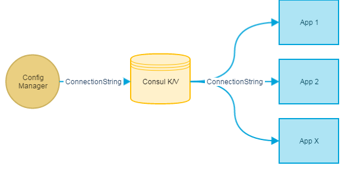

An implementation of [ServiceStack](https://servicestack.net/) [IAppSettings](https://github.com/ServiceStack/ServiceStack/wiki/AppSettings) interface that uses [Consul.io key/value store](https://www.consul.io/docs/agent/http/kv.html) as backing storage.

# Requirements
An accessible running consul agent.

## Local Agent
To get consul.io running locally follow the [Install Consul](https://www.consul.io/intro/getting-started/install.html) guide on the main website. Once this has been installed you can run it with:

```bash
consul.exe agent -dev -advertise="127.0.0.1"
```

This will start Consul running and accessible on http://127.0.0.1:8500.  You should now be able to view the [Consul UI](http://127.0.0.1:8500/ui) to verify. This has a [Key/Value tab](http://127.0.0.1:8500/ui/#/dc1/kv/) where stored keys can be managed.


# Quick Start
The `ConsulAppSetting` is setup like any other implementation of AppSettings. To set `ConsulAppSettings` as the default `IAppSettings` implementation for an AppHost add the following line while configuring an AppHost:

```csharp
public override void Configure(Container container)
{
    // ..standard setup... 
	
    AppSettings = new ConsulAppSettings();
}
```
`ConsulAppSettings` also works as part of a cascading configuration setup using `MultiAppSettings`. The following will check Consul first, then local appSetting (app.config/web.config) before finally checking Environment variables.

```csharp
AppSettings = new MultiAppSettings(
    new ConsulAppSettings(),
    new AppSettings(), 
    new EnvironmentVariableSettings());
```

The `IAppSetting` instances can be auto-wired into services like all other dependencies:

```csharp
public class MyService : Service
{
    public IAppSettings AppSettings { get; set; }
	
	public object Get(KeyRequest key) { ... }
}
```

# Demo
ServiceStack.Configuration.Consul.Demo is a console app that starts a self hosted application that runs as [http://127.0.0.1:8093/](http://127.0.0.1:8093/). This contains a simple service that takes a GET and PUT request:

* GET http://127.0.0.1:8093/keys/all - get all key names
* GET http://127.0.0.1:8093/keys/{key} - get config value with specified key
* PUT http://127.0.0.1:8093/keys/{key}, body: {Body:testtest}, header: content-type=application/jsv - create new config value with specified name and content.

The "Postman Samples" folder contains a sample [Postman](https://www.getpostman.com/) collection containing sample calls. Use the "Import" function in Postman to import this collection, this contains sample PUT and GET requests that can be run against the demo service.

# Why?
When implementing distributed systems it makes life easier to decouple configuration from code and manage it as an external concern. This allows a central place for all shared configuration values which can then be access by a number of systems. It then becomes faster and easier to make configuration changes; an update is made once and can be used everywhere.

For example, if a range of systems need to use the same connection string this can be updated in the central Consul K/V store and is then available to all applications without needing to make any changes to them (e.g. redeploy or bouncing appPools etc):

